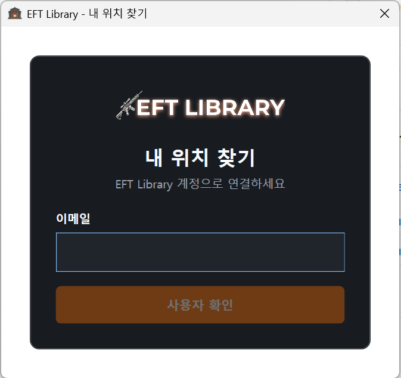
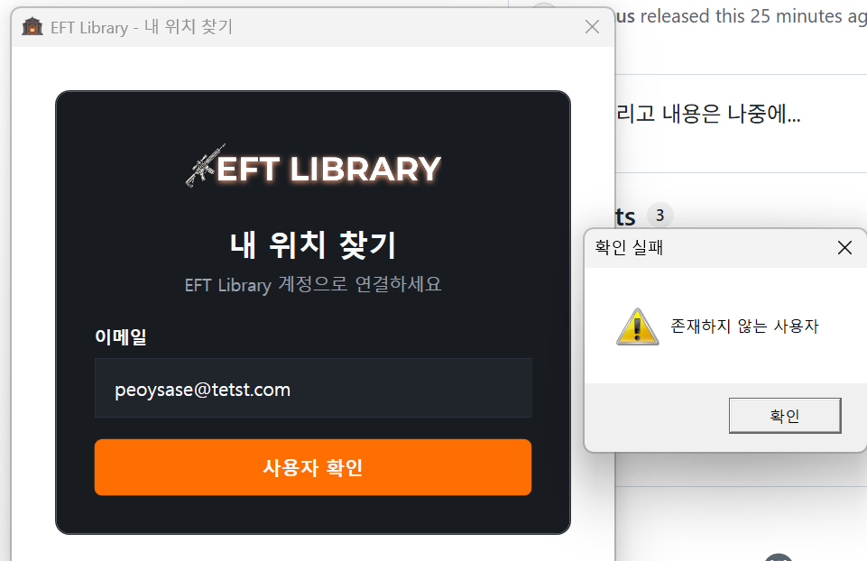
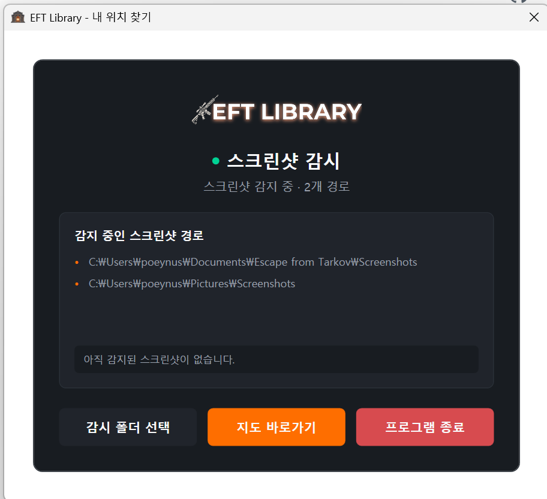
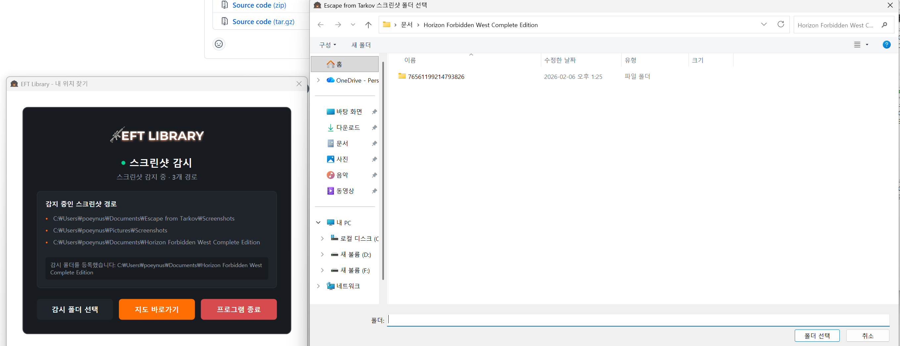
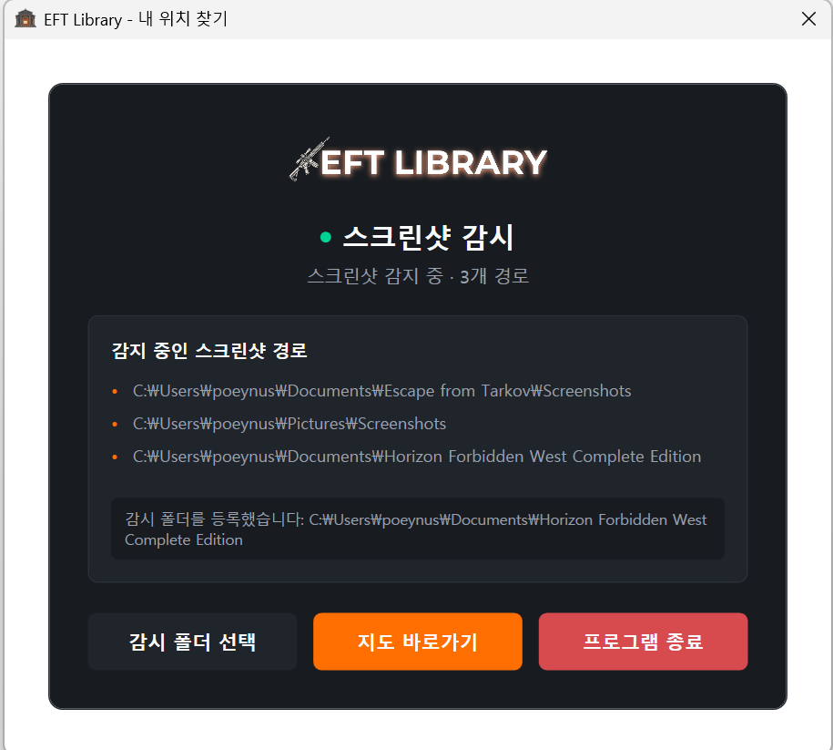
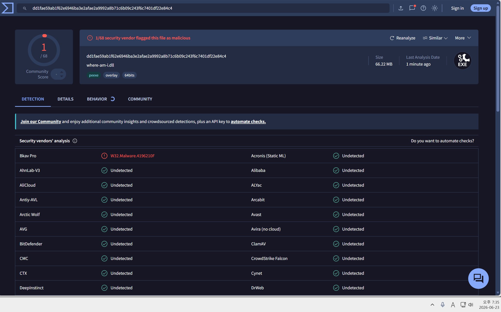
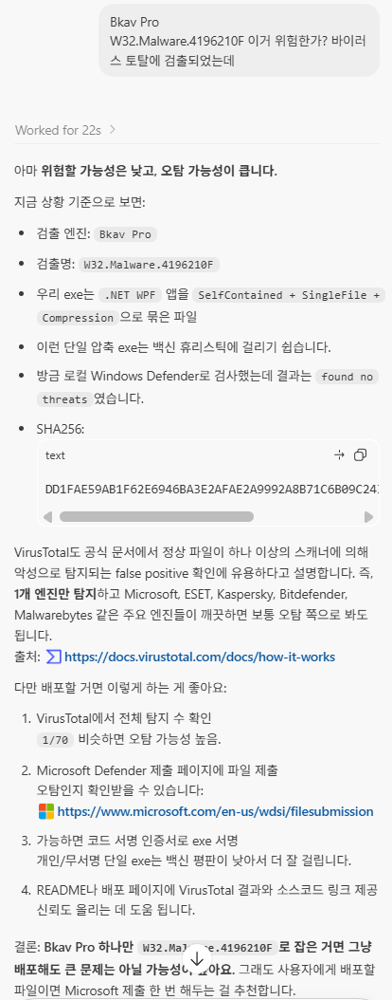

# 내 위치 찾기 V 2.0

## 타르코프 도서관 사이트의 내 위치 찾기와 연동하는 프로그램 입니다.

게임에서 스크린샷을 캡쳐한 경우, 사이트와 연동하는 기능만을 구현하였습니다.

**최소한의 코드로 개발을 하였고, 디자인을 고려하지 않았습니다... ;;;**

## 프로그램 프로세스

프로그램의 흐름 입니다.

## 사용법

압축을 푼 뒤, where-am-i.exe 파일을 실행하세요

처음에 화면을 진입하시면, 이메일을 입력하는 창이 나옵니다. 

EFT Library 계정 이메일을 입력한 뒤 **사용자 확인**을 누릅니다.

실패하면 실패했다는 알림이 나오고, 성공하면 화면이 이동합니다.

**실패**

등록되지 않은 이메일을 입력하면 **존재하지 않는 사용자** 알림이 표시됩니다.

**성공**

사용자 확인에 성공하면 스크린샷 감시 화면으로 이동하고, 자동으로 찾은 감시 경로가 표시됩니다.

스크린샷 폴더가 자동으로 잡히지 않으면 **감시 폴더 선택** 버튼으로 직접 추가할 수 있습니다.

폴더가 정상 등록되면 감시 경로 목록에 새 경로가 추가됩니다.

성공시 자동으로 동작하기에 그냥 방치하시면 됩니다.

이제 사이트의 내 위치 찾기 페이지로 가시면 바로 동작합니다.

## 바이러스 검사 결과

VirusTotal에서 확인한 바이러스 여부 입니다.

1개 엔진만 탐지하는 경우 단일 파일 exe 배포 특성상 오탐일 수 있습니다. Windows Defender 등 주요 엔진의 검사 결과도 함께 확인해 주세요.

